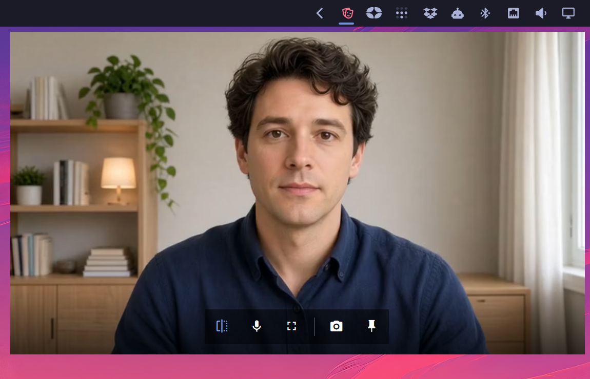
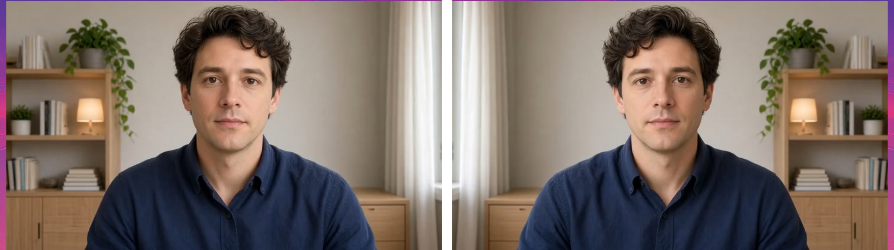
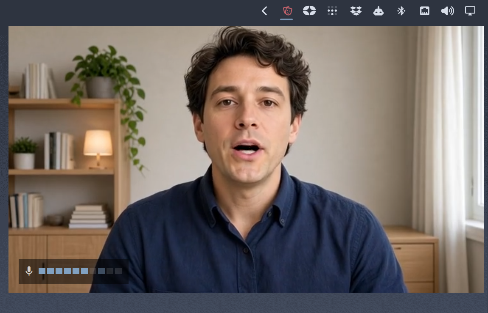
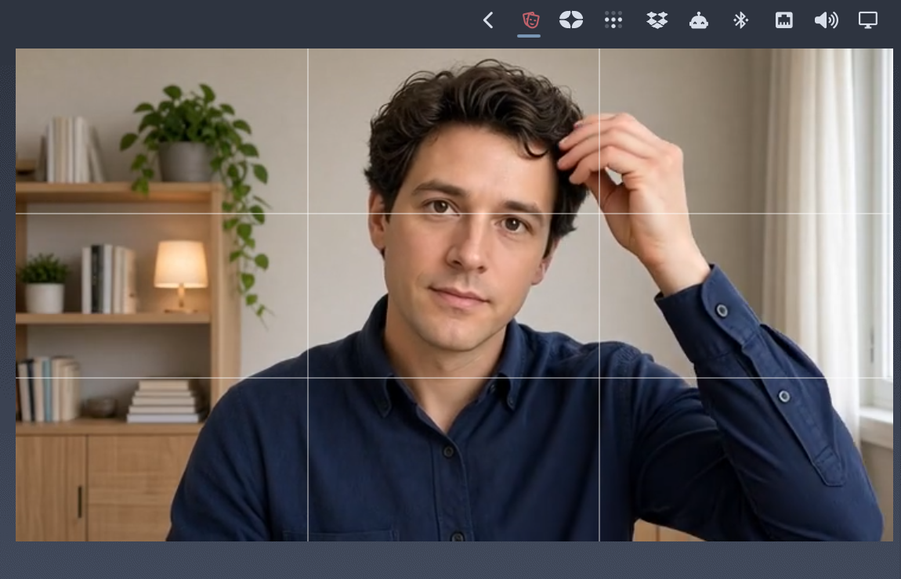
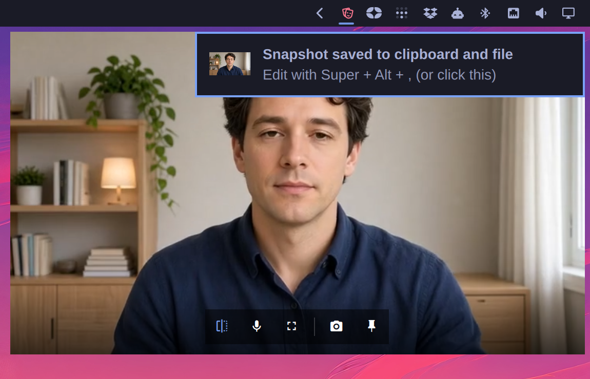

# Green Room

[](https://github.com/joaodrp/omarchy-green-room/actions/workflows/ci.yml)
[](LICENSE)

A quick check of how you look and sound, from the Omarchy bar. In the spirit of
[Hand Mirror](https://handmirror.app/) for macOS: click the bar icon, see yourself in a
mirrored live preview, click again and the camera is off.



## Highlights

- 🪞 One click, live 16:9 video, mirrored like a mirror. `m` shows what others see.
- 🔒 The camera runs only while a mirror is showing. Close it and `/dev/videoN` is free within
  a couple of seconds; nothing streams in the background, ever.
- 🎙️ Mic check: a level meter that puts speech mid-meter, holds peaks, and turns urgent when
  you run hot.
- 📐 Framing guides: rule of thirds, with the top line for your eyes.
- 📌 Pop out: a small always-on-top mirror that follows you across workspaces. Drag to move,
  drag any corner to resize.
- 📸 Snapshot: what the glass shows, saved and announced like an Omarchy screenshot.
- ⌨️ Every control has a key, and the controls stay out of the way until you hover.
- 🎨 Built from the shell's own components. Follows your theme; no settings page to visit.

## Install

```sh
omarchy plugin add https://github.com/joaodrp/omarchy-green-room.git --enable
```

## What it shows

Left click opens the mirror, click again closes it. The glass is dark until the first frame
arrives, then the video fades in. Hover for the controls:

| Control | Key | Does |
| --- | --- | --- |
| Flip | `m` | Mirrored, or as others see you |
| Next camera | `c` | Only with more than one camera; the choice sticks |
| Mic check | `a` | Show or hide the level meter |
| Framing guides | `g` | Show or hide the rule-of-thirds lines |
| Snapshot | `s` | Save the current picture |
| Pop out | `p` | Lift the mirror into a corner window |
| | `esc` | Close |

The mic chip stays reachable when the camera is missing or broken, which is exactly when "at
least check my mic" matters.

### Flip



Mirrored by default, because that is how you fix your hair. `m` shows the picture the other
side of the call gets; a snapshot saves whichever is showing.

### Mic check



Ten cells across -60..0 dBFS, 6 dB each, so speech lands mid-meter the way it does in other
mic-check UIs and syllables visibly move it. The top cell starts at -6 dBFS and lights in the
theme's urgent color. The brightest recently hit cell keeps glowing for a second, so a peak that
lands between glances still registers.

Hover the meter to see which microphone it reads. It follows the system default, so a
forgotten headset shows up here. A muted or missing mic shows a slashed glyph instead of a
silently flat bar.

### Framing guides



Eyes on the top line, face in the middle third, and you are framed the way the other side of
the call expects. The one thing a mirror cannot tell you is whether you are centered and at
eye height; the lines can.

### Pop out


The mirror lifts out of the popup into a small always-on-top 16:9 window in the bottom-right
corner that follows you across workspaces. Drag anywhere to move it; drag any corner to resize
it, aspect locked, and the size sticks. The hover chip docks it back into the panel; a click on
the bar icon, or `esc` once the window has focus, closes it outright. The mic meter comes along
when the check is on.

### Snapshot



`s` saves what the glass shows, mirrored or not, 16:9, at camera resolution, as a PNG in your
screenshot directory, copies it to the clipboard, and sends the same notification a screenshot
does: click it, or press `Super + Alt + ,`, to open the picture in the screenshot editor.
Press `m` first for the picture others see.

## Settings

Set through the bar's widget settings, or inline on the widget's `shell.json` entry:

| Key | Default | Meaning |
| --- | --- | --- |
| `device` | `auto` | Camera device id; `auto` follows the system default |
| `mirror` | `true` | Mirror the preview horizontally |
| `micCheck` | `false` | Show the mic level meter |
| `guides` | `false` | Show the framing guides |
| `previewWidth` | `560` | Mirror width in px, 320-960, 16:9 |
| `pinWidth` | `320` | Pinned mirror width in px, 240-960, 16:9; also set by resizing the pin |

## Privacy

- **The camera is opened when a mirror shows and released when the last one closes.** Not
  paused, released: on Qt's camera backend a paused camera keeps the device open, so this plugin
  destroys the capture stack instead. `fuser /dev/video0` shows the shell holding the device
  while the mirror is up, and nothing within about two seconds of closing it.
- **The microphone is read only while the mic check is on and a mirror is showing.** The
  meter holds a real capture stream for that time, which is what makes a Bluetooth headset
  switch to its call profile and show the mic a call would use, rather than the one it idles
  on. Released with the mirror.
- **Nothing leaves the machine.** No daemon, no background process, no network. A snapshot is
  a file in your pictures directory and nowhere else.

[How it works](docs/how-it-works.md) has the detail.

## Requirements

- Omarchy 4.0 or newer
- Qt Multimedia (`qt6-multimedia`)
- A V4L2 webcam

Everything else ships with Omarchy: `wl-copy`, `magick` and `omarchy-notification-send` for the
snapshot, PipeWire for the meter.

## Scripting

```sh
omarchy-shell io.github.joaodrp.green-room toggle
omarchy-shell io.github.joaodrp.green-room open
omarchy-shell io.github.joaodrp.green-room close   # also closes a popped-out mirror
```

Bind `toggle` to a key for a mirror that needs no mouse at all.

## Why not omarchy-webcam or cam-preview?

[Webcam Controls](https://github.com/kristoferlund/omarchy-webcam) is a camera tuning tool with
a preview attached. [Camera Preview](https://github.com/mandavkarpranjal/cam-preview) predates
Qt versions where live video works in the shell and renders a still-capture slideshow. Green
Room is the pre-meeting check, and only that: one click, live video, mirrored, with a mic
meter, guides, a corner mirror and a snapshot when you want them.

## Contributing

Bug reports and pull requests welcome. See [CONTRIBUTING.md](CONTRIBUTING.md) to get set up, and
[docs/how-it-works.md](docs/how-it-works.md) for how the pieces fit.

## Remove

```sh
omarchy plugin remove io.github.joaodrp.green-room
```

## License

MIT, see [LICENSE](LICENSE).

<sub>The person in the screenshots is AI-generated.</sub>
